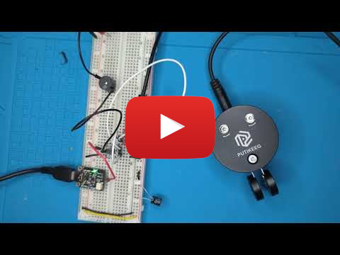

# Bug emulator

I got quite interested in the [mechanics behind Vibroplex
bugs](http://kbsriram.github.io/vibroplex-bug-analysis) and moved the
simulation into an MCU to get a feel for how this works directly.

A short demo of how it works.

